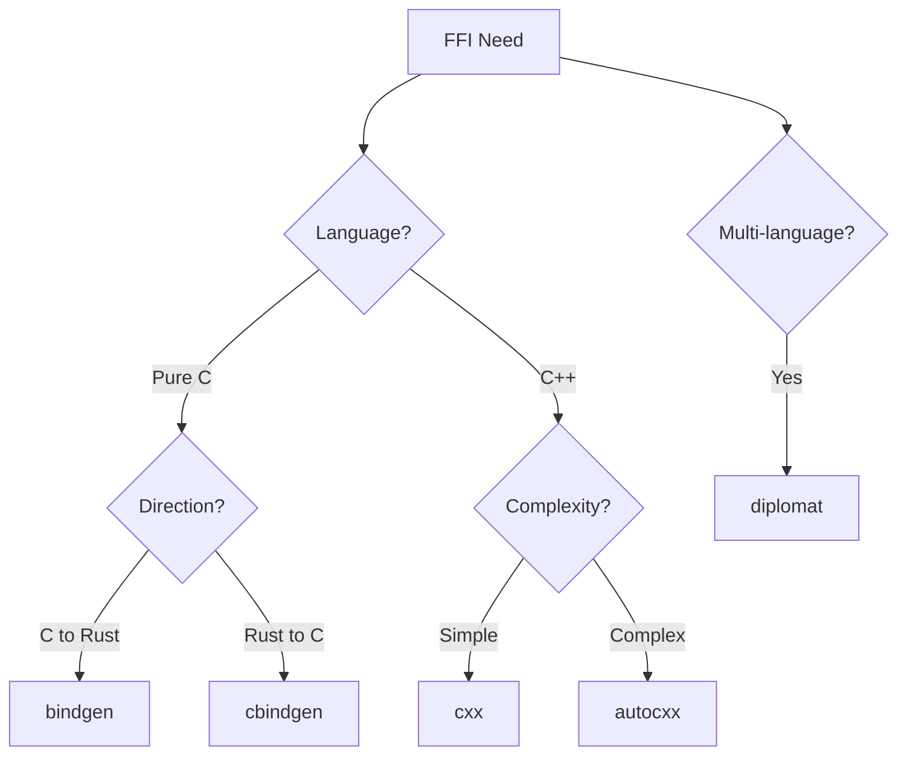

# Chapter 22: Unsafe Rust & FFI - Bridging Languages in Production

## Learning Objectives
- Master unsafe Rust and its safety contracts
- Build bidirectional FFI bridges between Rust and C/C++
- Integrate Rust into existing C/C++ build systems and vice versa
- Understand FFI implications for reproducible builds and safety
- Use modern tools: bindgen, cbindgen, cxx, and autocxx (2024)

## Part 1: Unsafe Rust Foundations

### The Five Unsafe Superpowers (Rust 2024)

Unsafe Rust enables:
1. **Dereference raw pointers** - Direct memory access
2. **Call unsafe functions/methods** - Including FFI functions
3. **Access/modify mutable statics** - Global state management
4. **Implement unsafe traits** - Like `Send` and `Sync`
5. **Access union fields** - Memory reinterpretation

### Modern Unsafe Patterns (2024 Edition)

```rust
// 1. FFI with C libraries (now with safer extern blocks)
extern "C" {
    fn strlen(s: *const c_char) -> size_t;
}

// 2. SIMD and performance-critical code
use std::arch::x86_64::*;

unsafe fn fast_compare_simd(a: &[u8; 32], b: &[u8; 32]) -> bool {
    let a_vec = _mm256_loadu_si256(a.as_ptr() as *const __m256i);
    let b_vec = _mm256_loadu_si256(b.as_ptr() as *const __m256i);
    let result = _mm256_cmpeq_epi8(a_vec, b_vec);
    _mm256_movemask_epi8(result) == -1
}

// 3. Zero-copy parsing with lifetime guarantees
#[repr(C)]
struct PacketHeader {
    version: u8,
    flags: u8,
    length: u16,
}

unsafe fn parse_packet_zero_copy(data: &[u8]) -> &PacketHeader {
    assert!(data.len() >= std::mem::size_of::<PacketHeader>());
    &*(data.as_ptr() as *const PacketHeader)
}
```

## Part 2: Calling C/C++ from Rust

### Manual FFI Bindings

```rust
use std::os::raw::{c_char, c_int, c_void};
use std::ffi::{CString, CStr};

// Link to system libraries
#[link(name = "sqlite3")]
extern "C" {
    fn sqlite3_libversion() -> *const c_char;
    fn sqlite3_open(filename: *const c_char, ppDb: *mut *mut c_void) -> c_int;
    fn sqlite3_close(db: *mut c_void) -> c_int;
}

// Safe wrapper
pub fn get_sqlite_version() -> String {
    unsafe {
        let version_ptr = sqlite3_libversion();
        CStr::from_ptr(version_ptr)
            .to_string_lossy()
            .into_owned()
    }
}
```

### Using Bindgen (Automatic C Binding Generation)

```toml
# Cargo.toml
[build-dependencies]
bindgen = "0.70"  # Latest 2024 version
cc = "1.1"

[dependencies]
libc = "0.2"
```

```rust
// build.rs
use std::env;
use std::path::PathBuf;

fn main() {
    // Tell cargo to link the system library
    println!("cargo:rustc-link-lib=ssl");
    println!("cargo:rustc-link-lib=crypto");

    // Generate bindings
    let bindings = bindgen::Builder::default()
        .header("wrapper.h")
        // Use Rust 2024 features
        .rust_target(bindgen::RustTarget::Stable_1_77)
        .allowlist_function("SSL_.*")
        .allowlist_type("SSL.*")
        .derive_default(true)
        .derive_debug(true)
        // Handle C++ if needed
        .clang_arg("-x")
        .clang_arg("c++")
        .clang_arg("-std=c++17")
        .generate()
        .expect("Unable to generate bindings");

    let out_path = PathBuf::from(env::var("OUT_DIR").unwrap());
    bindings
        .write_to_file(out_path.join("bindings.rs"))
        .expect("Couldn't write bindings!");
}
```

### Modern C++ Integration with CXX (2024 Recommended)

```toml
# Cargo.toml
[dependencies]
cxx = "1.0"

[build-dependencies]
cxx-build = "1.0"
```

```rust
// src/main.rs
#[cxx::bridge]
mod ffi {
    // Shared structs between Rust and C++
    struct Point {
        x: f64,
        y: f64,
    }

    unsafe extern "C++" {
        include!("geometry.h");

        type Circle;

        fn create_circle(center: Point, radius: f64) -> UniquePtr<Circle>;
        fn area(self: &Circle) -> f64;
        fn contains_point(self: &Circle, p: Point) -> bool;
    }

    extern "Rust" {
        fn process_circle(circle: &Circle);
    }
}

fn process_circle(circle: &ffi::Circle) {
    println!("Circle area: {}", circle.area());
}

fn main() {
    let circle = ffi::create_circle(
        ffi::Point { x: 0.0, y: 0.0 },
        5.0
    );

    println!("Area: {}", circle.area());
    println!("Contains (3,4): {}",
        circle.contains_point(ffi::Point { x: 3.0, y: 4.0 }));
}
```

## Part 3: Calling Rust from C/C++

### Using cbindgen for C Header Generation

```toml
# Cargo.toml
[lib]
crate-type = ["cdylib", "staticlib"]

[build-dependencies]
cbindgen = "0.27"  # Latest 2024 version
```

```rust
// build.rs
use std::env;

fn main() {
    let crate_dir = env::var("CARGO_MANIFEST_DIR").unwrap();

    cbindgen::Builder::new()
        .with_crate(crate_dir)
        .with_language(cbindgen::Language::C)
        .generate()
        .expect("Unable to generate bindings")
        .write_to_file("bindings.h");
}
```

```rust
// src/lib.rs - Rust library to be called from C
use std::ffi::{c_char, CStr, CString};

/// Opaque Rust type for C
#[repr(C)]
pub struct RustProcessor {
    _private: [u8; 0],
}

/// Create a new processor instance
#[no_mangle]
pub extern "C" fn rust_processor_new() -> *mut RustProcessor {
    let processor = Box::new(ProcessorImpl::new());
    Box::into_raw(processor) as *mut RustProcessor
}

/// Process data with the Rust implementation
#[no_mangle]
pub extern "C" fn rust_processor_process(
    processor: *mut RustProcessor,
    input: *const c_char,
    output: *mut c_char,
    output_len: usize,
) -> i32 {
    if processor.is_null() || input.is_null() || output.is_null() {
        return -1;
    }

    unsafe {
        let processor = &mut *(processor as *mut ProcessorImpl);
        let input_str = match CStr::from_ptr(input).to_str() {
            Ok(s) => s,
            Err(_) => return -2,
        };

        let result = processor.process(input_str);
        let result_bytes = result.as_bytes();

        if result_bytes.len() >= output_len {
            return -3;
        }

        std::ptr::copy_nonoverlapping(
            result_bytes.as_ptr(),
            output as *mut u8,
            result_bytes.len(),
        );
        *output.add(result_bytes.len()) = 0;

        result_bytes.len() as i32
    }
}

/// Free the processor instance
#[no_mangle]
pub extern "C" fn rust_processor_free(processor: *mut RustProcessor) {
    if !processor.is_null() {
        unsafe {
            let _ = Box::from_raw(processor as *mut ProcessorImpl);
        }
    }
}

// Internal implementation
struct ProcessorImpl {
    counter: u32,
}

impl ProcessorImpl {
    fn new() -> Self {
        ProcessorImpl { counter: 0 }
    }

    fn process(&mut self, input: &str) -> String {
        self.counter += 1;
        format!("Processed #{}: {}", self.counter, input.to_uppercase())
    }
}
```

### C Usage Example

```c
// main.c - Using the Rust library from C
#include "bindings.h"
#include <stdio.h>

int main() {
    // Create Rust processor
    RustProcessor* processor = rust_processor_new();
    if (!processor) {
        fprintf(stderr, "Failed to create processor\n");
        return 1;
    }

    // Process some data
    char output[256];
    int result = rust_processor_process(
        processor,
        "hello from c",
        output,
        sizeof(output)
    );

    if (result > 0) {
        printf("Result: %s\n", output);
    }

    // Clean up
    rust_processor_free(processor);
    return 0;
}
```

```makefile
# Makefile
RUST_LIB = target/release/libmyrust.a

main: main.c $(RUST_LIB)
	gcc -o main main.c $(RUST_LIB) -lpthread -ldl

$(RUST_LIB):
	cargo build --release

clean:
	rm -f main
	cargo clean
```

## Part 4: Build System Integration

### Integrating Rust into CMake Projects

```cmake
# CMakeLists.txt - Adding Rust to existing C++ project
cmake_minimum_required(VERSION 3.22)
project(MixedProject)

# Find or bootstrap Cargo
find_program(CARGO cargo REQUIRED)

# Rust library target
set(RUST_LIB_NAME myrust)
set(RUST_LIB_PATH ${CMAKE_BINARY_DIR}/rust/${CMAKE_BUILD_TYPE}/lib${RUST_LIB_NAME}.a)

add_custom_command(
    OUTPUT ${RUST_LIB_PATH}
    COMMAND ${CMAKE_COMMAND} -E env
        CARGO_TARGET_DIR=${CMAKE_BINARY_DIR}/rust
        ${CARGO} build
        --manifest-path ${CMAKE_SOURCE_DIR}/rust-lib/Cargo.toml
        $<$<CONFIG:Release>:--release>
    DEPENDS
        ${CMAKE_SOURCE_DIR}/rust-lib/Cargo.toml
        ${CMAKE_SOURCE_DIR}/rust-lib/src/lib.rs
    COMMENT "Building Rust library"
)

add_custom_target(rust_lib ALL DEPENDS ${RUST_LIB_PATH})

# C++ executable that uses Rust
add_executable(main main.cpp)
add_dependencies(main rust_lib)
target_link_libraries(main PRIVATE ${RUST_LIB_PATH} pthread dl)
```

### Using Cargo to Build C Dependencies

```rust
// build.rs - Building C code from Rust
use cc;
use cmake;

fn main() {
    // Option 1: Using cc crate for simple C files
    cc::Build::new()
        .file("src/native/helper.c")
        .include("src/native")
        .compile("helper");

    // Option 2: Using cmake crate for complex projects
    let dst = cmake::Config::new("libfoo")
        .define("BUILD_SHARED_LIBS", "OFF")
        .build();

    println!("cargo:rustc-link-search=native={}/lib", dst.display());
    println!("cargo:rustc-link-lib=static=foo");

    // Option 3: Using pkg-config for system libraries
    pkg_config::Config::new()
        .atleast_version("2.0")
        .probe("openssl")
        .unwrap();
}
```

### Real-World Examples from Major Projects

```toml
# Firefox (Gecko) - Rust components in C++ browser
# Uses custom build system integration
# See: mozilla-central/toolkit/library/rust/

# Librsvg - GNOME's SVG library, migrated from C to Rust
# Uses Meson build system with Rust integration
# See: gitlab.gnome.org/GNOME/librsvg

# curl - HTTP library with optional Rust HTTP/3 backend
# Uses autotools with Rust detection
# See: github.com/curl/curl (--with-quiche option)

# Linux Kernel - Rust support since 6.1
# Uses Kbuild with custom Rust integration
# See: kernel.org/doc/html/latest/rust/
```

## Part 5: Reproducible Builds and FFI

### FFI Impact on Reproducibility

FFI introduces several challenges for reproducible builds:

1. **System Library Versions** - Different platforms have different versions
2. **Build Tool Versions** - bindgen, clang versions affect output
3. **Header File Paths** - System headers vary across distributions
4. **Symbol Visibility** - Platform-specific linking behavior

### Strategies for Reproducible FFI Builds

```toml
# Cargo.toml - Lock dependencies and specify exact versions
[dependencies]
libc = "=0.2.155"  # Exact version

[build-dependencies]
bindgen = "=0.70.1"  # Exact version
cc = "=1.1.6"

# Use cargo-vendor for offline builds
# cargo vendor
# Create .cargo/config.toml:
# [source.crates-io]
# replace-with = "vendored-sources"
# [source.vendored-sources]
# directory = "vendor"
```

```rust
// build.rs - Reproducible bindgen configuration
use std::path::PathBuf;

fn main() {
    // Use vendored headers instead of system headers
    let bindings = bindgen::Builder::default()
        .header("vendor/include/library.h")
        // Explicitly set target for cross-platform consistency
        .clang_arg("--target=x86_64-unknown-linux-gnu")
        // Use specific sysroot for headers
        .clang_arg("--sysroot=/path/to/sysroot")
        // Disable time-dependent macros
        .clang_arg("-D__DATE__=\"\"")
        .clang_arg("-D__TIME__=\"\"")
        // Generate deterministic output
        .generate_comments(false)
        .layout_tests(false)
        .generate()
        .expect("Unable to generate bindings");

    // Use OUT_DIR for generated files
    let out_path = PathBuf::from(std::env::var("OUT_DIR").unwrap());
    bindings
        .write_to_file(out_path.join("bindings.rs"))
        .expect("Couldn't write bindings!");
}
```

### Container-Based Reproducible Builds

```dockerfile
# Dockerfile for reproducible FFI builds
FROM rust:1.77-bookworm AS builder

# Install specific versions of build dependencies
RUN apt-get update && apt-get install -y \
    clang-15=1:15.0.7-1 \
    libssl-dev=3.0.11-1 \
    && rm -rf /var/lib/apt/lists/*

# Pin Rust toolchain
RUN rustup default 1.77.0
RUN rustup component add rustfmt clippy

# Copy and build
WORKDIR /app
COPY . .
RUN cargo build --release --locked

# Runtime stage
FROM debian:bookworm-slim
RUN apt-get update && apt-get install -y \
    libssl3=3.0.11-1 \
    && rm -rf /var/lib/apt/lists/*

COPY --from=builder /app/target/release/myapp /usr/local/bin/
CMD ["myapp"]
```

## Part 6: Safety Considerations and Best Practices

### FFI Safety Checklist

```rust
// ✅ GOOD: Validate all inputs from FFI boundary
#[no_mangle]
pub extern "C" fn safe_function(ptr: *const u8, len: usize) -> i32 {
    // Check for null pointers
    if ptr.is_null() {
        return -1;
    }

    // Validate length to prevent overflow
    if len > isize::MAX as usize {
        return -2;
    }

    // Create slice with explicit lifetime
    let slice = unsafe {
        std::slice::from_raw_parts(ptr, len)
    };

    // Use safe Rust from here
    process_data(slice)
}

// ❌ BAD: Trusting FFI inputs
#[no_mangle]
pub extern "C" fn unsafe_function(ptr: *const u8, len: usize) -> i32 {
    // Direct usage without validation!
    let slice = unsafe {
        std::slice::from_raw_parts(ptr, len)
    };
    process_data(slice)
}
```

### Thread Safety Across FFI

```rust
use std::sync::Mutex;
use once_cell::sync::Lazy;

// Thread-safe global state for FFI
static GLOBAL_STATE: Lazy<Mutex<State>> = Lazy::new(|| {
    Mutex::new(State::new())
});

#[no_mangle]
pub extern "C" fn thread_safe_operation(value: i32) -> i32 {
    let mut state = GLOBAL_STATE.lock().unwrap();
    state.process(value)
}

// Mark functions that require external synchronization
/// # Safety
/// This function is NOT thread-safe. Caller must ensure
/// exclusive access during calls.
#[no_mangle]
pub unsafe extern "C" fn not_thread_safe_operation(ptr: *mut State) -> i32 {
    if ptr.is_null() {
        return -1;
    }
    (*ptr).process(42)
}
```

### Memory Management Patterns

```rust
// Pattern 1: Rust allocates, Rust frees
#[no_mangle]
pub extern "C" fn rust_alloc_string(s: *const c_char) -> *mut c_char {
    if s.is_null() {
        return std::ptr::null_mut();
    }

    unsafe {
        let input = CStr::from_ptr(s).to_string_lossy();
        let output = CString::new(format!("Processed: {}", input))
            .unwrap();
        output.into_raw()
    }
}

#[no_mangle]
pub extern "C" fn rust_free_string(s: *mut c_char) {
    if !s.is_null() {
        unsafe {
            let _ = CString::from_raw(s);
        }
    }
}

// Pattern 2: Caller provides buffer
#[no_mangle]
pub extern "C" fn process_into_buffer(
    input: *const c_char,
    output: *mut c_char,
    output_size: usize,
) -> i32 {
    if input.is_null() || output.is_null() || output_size == 0 {
        return -1;
    }

    unsafe {
        let input_str = CStr::from_ptr(input).to_string_lossy();
        let processed = format!("Result: {}", input_str.to_uppercase());
        let bytes = processed.as_bytes();

        if bytes.len() >= output_size {
            return -2;  // Buffer too small
        }

        std::ptr::copy_nonoverlapping(
            bytes.as_ptr(),
            output as *mut u8,
            bytes.len(),
        );
        *output.add(bytes.len()) = 0;  // Null terminator

        bytes.len() as i32
    }
}
```

## Part 7: Common FFI Pitfalls and Solutions

### ABI Compatibility Issues

```rust
// ❌ BAD: Using Rust-specific types across FFI
#[no_mangle]
pub extern "C" fn bad_ffi(s: String) -> Vec<u8> {  // Won't work!
    s.into_bytes()
}

// ✅ GOOD: Use C-compatible types
#[no_mangle]
pub extern "C" fn good_ffi(s: *const c_char, out: *mut u8, out_len: *mut usize) -> i32 {
    if s.is_null() || out.is_null() || out_len.is_null() {
        return -1;
    }
    // Implementation...
    0
}
```

### Lifetime and Ownership Confusion

```rust
// ❌ BAD: Returning references across FFI
#[no_mangle]
pub extern "C" fn get_static_str() -> *const c_char {
    let s = String::from("temporary");
    s.as_ptr() as *const c_char  // Dangling pointer!
}

// ✅ GOOD: Return static or heap-allocated data
static STATIC_STR: &[u8] = b"permanent\0";

#[no_mangle]
pub extern "C" fn get_static_str() -> *const c_char {
    STATIC_STR.as_ptr() as *const c_char
}
```

### Platform-Specific Size Assumptions

```rust
// ❌ BAD: Assuming size_t is usize
extern "C" {
    fn process(data: *const u8, size: usize);  // May not match C's size_t!
}

// ✅ GOOD: Use libc types
use libc::size_t;

extern "C" {
    fn process(data: *const u8, size: size_t);
}
```

## Part 8: Modern FFI Tools Comparison (2024)

| Tool | Use Case | Pros | Cons |
|------|----------|------|------|
| **bindgen** | C → Rust | Automatic, handles complex headers | Requires clang, unsafe bindings |
| **cbindgen** | Rust → C | Simple, generates clean headers | Manual memory management |
| **cxx** | C++ ↔ Rust | Type-safe, zero-cost | Limited C++ feature support |
| **autocxx** | C++ → Rust | Handles more C++ features | Larger compile times |
| **diplomat** | Rust → Multiple | Multi-language support | Additional complexity |

### Quick Decision Guide



## Try It Yourself

### Exercise 1: Cross-Language Data Structure
Create a Rust library that exposes a thread-safe queue to C:
```rust
// Requirements:
// - Thread-safe push/pop operations
// - C-compatible interface
// - Proper memory management
// - Error codes for empty queue
```

### Exercise 2: Build System Integration
Set up a CMake project that:
- Builds a Rust static library
- Links it with a C++ application
- Handles cross-compilation to ARM64
- Ensures reproducible builds

### Exercise 3: Safety Audit
Review this FFI code and identify all safety issues:
```rust
#[no_mangle]
pub extern "C" fn process_data(input: *const u8, len: usize) -> *mut u8 {
    let slice = unsafe { std::slice::from_raw_parts(input, len) };
    let processed = slice.iter().map(|x| x + 1).collect::<Vec<_>>();
    Box::into_raw(processed.into_boxed_slice()) as *mut u8
}
```

## Best Practices Summary (2024)

### Safety First
- **Always validate** FFI inputs (null checks, bounds checks)
- **Document safety contracts** explicitly in comments
- **Use safe wrappers** - never expose raw unsafe APIs
- **Test with sanitizers** - Use AddressSanitizer, ThreadSanitizer
- **Run Miri** on FFI code to catch UB

### Build Reproducibility
- **Pin all versions** - Use exact versions in Cargo.toml
- **Vendor dependencies** - Use cargo-vendor for offline builds
- **Container builds** - Use Docker for consistent environments
- **Document toolchain** - Specify exact Rust, clang, GCC versions

### Performance
- **Minimize allocations** across FFI boundary
- **Use repr(C)** for zero-cost struct passing
- **Batch operations** to reduce FFI overhead
- **Profile FFI calls** - They can be surprisingly expensive

### Maintenance
- **Generate bindings** in CI to catch breaking changes
- **Version your C API** with proper symbol versioning
- **Use integration tests** that exercise FFI paths
- **Document ownership** clearly for every pointer

## Real-World Case Studies

### Firecracker (Amazon)
- Uses Rust for VMM, interfaces with KVM (C API)
- Clean FFI abstractions for system calls
- See: github.com/firecracker-microvm/firecracker

### Stylo (Mozilla Firefox)
- Rust CSS engine integrated into C++ browser
- Complex bidirectional FFI with careful lifetime management
- See: github.com/servo/servo

### Rustls (Used by curl, nginx)
- Pure Rust TLS replacing OpenSSL
- C API via rustls-ffi for drop-in replacement
- See: github.com/rustls/rustls-ffi

### Linux Kernel Rust Support
- Kernel modules in Rust calling C kernel APIs
- Custom abstractions for kernel-specific patterns
- See: rust-for-linux.com

## Summary

FFI is powerful but requires careful attention to:
- **Safety contracts** - Document and enforce invariants
- **Build reproducibility** - Control all dependencies
- **Performance** - Measure and optimize FFI overhead
- **Maintainability** - Use tools and automation

Modern tools (cxx, diplomat) make FFI safer and easier than ever, but understanding the fundamentals remains crucial for production systems.

---

Next: [Chapter 23: Embedded HAL - Hardware Register Access & Volatile Memory](./23_embedded_hal.md)